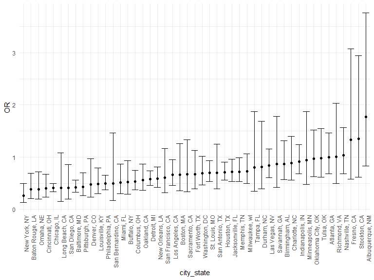
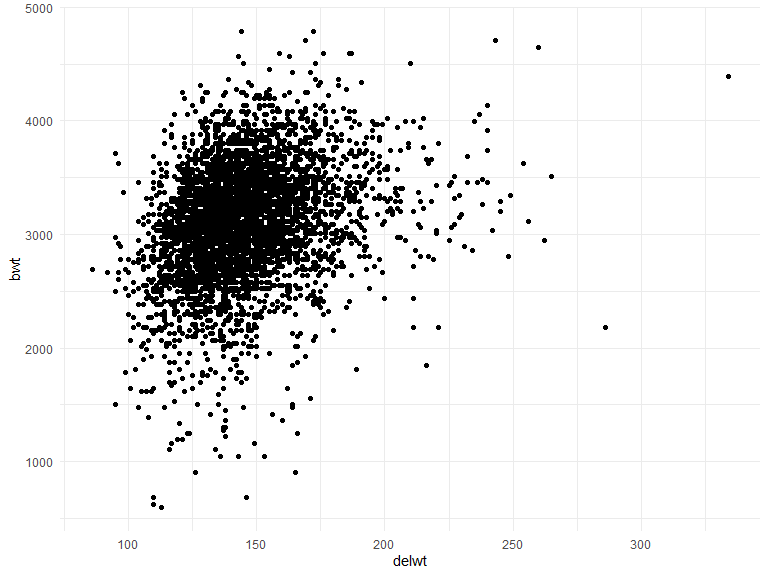
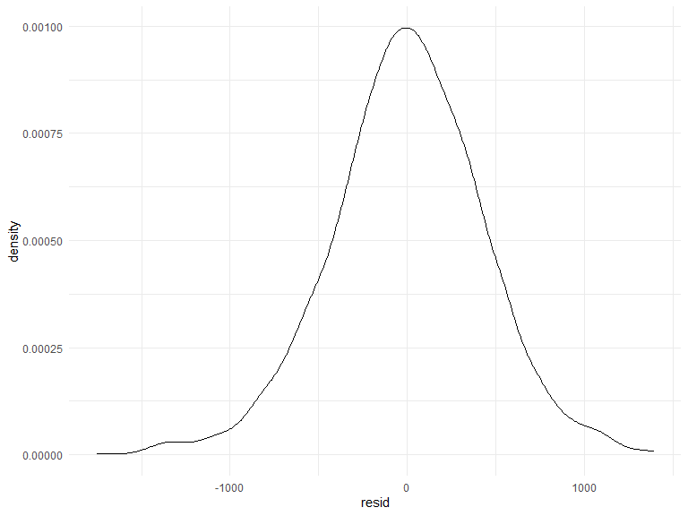
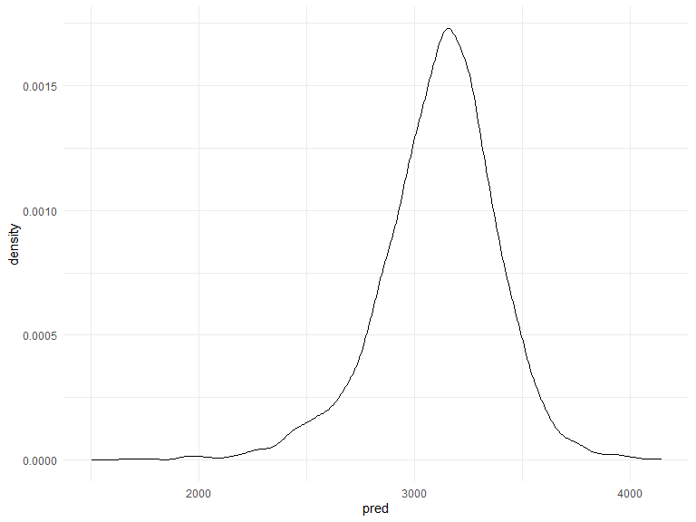
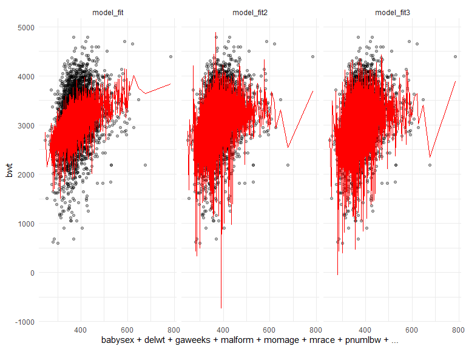

HW6 Ep2899
================

``` r
library(tidyverse)
library(modelr)
library(p8105.datasets)
library(mgcv)
```

    ## Loading required package: nlme

    ## 
    ## Attaching package: 'nlme'

    ## The following object is masked from 'package:dplyr':
    ## 
    ##     collapse

    ## This is mgcv 1.8-33. For overview type 'help("mgcv-package")'.

## Problem 1

Read in the data.

``` r
homicide_df = 
  read_csv("data/homicide-data.csv", na = c("", "NA", "Unknown")) %>% 
  mutate(
    city_state = str_c(city, state, sep = ", "),
    victim_age = as.numeric(victim_age),
    resolution = case_when(
      disposition == "Closed without arrest" ~ 0,
      disposition == "Open/No arrest"        ~ 0,
      disposition == "Closed by arrest"      ~ 1)
  ) %>% 
  filter(
    victim_race %in% c("White", "Black"),
    city_state != "Tulsa, AL") %>% 
  select(city_state, resolution, victim_age, victim_race, victim_sex)
```

    ## 
    ## -- Column specification --------------------------------------------------------
    ## cols(
    ##   uid = col_character(),
    ##   reported_date = col_double(),
    ##   victim_last = col_character(),
    ##   victim_first = col_character(),
    ##   victim_race = col_character(),
    ##   victim_age = col_double(),
    ##   victim_sex = col_character(),
    ##   city = col_character(),
    ##   state = col_character(),
    ##   lat = col_double(),
    ##   lon = col_double(),
    ##   disposition = col_character()
    ## )

Start with one city.

``` r
baltimore_df =
  homicide_df %>% 
  filter(city_state == "Baltimore, MD")

glm(resolution ~ victim_age + victim_race + victim_sex, 
    data = baltimore_df,
    family = binomial()) %>% 
  broom::tidy() %>% 
  mutate(
    OR = exp(estimate),
    CI_lower = exp(estimate - 1.96 * std.error),
    CI_upper = exp(estimate + 1.96 * std.error)
  ) %>% 
  select(term, OR, starts_with("CI")) %>% 
  knitr::kable(digits = 3)
```

| term              |    OR | CI\_lower | CI\_upper |
| :---------------- | ----: | --------: | --------: |
| (Intercept)       | 1.363 |     0.975 |     1.907 |
| victim\_age       | 0.993 |     0.987 |     1.000 |
| victim\_raceWhite | 2.320 |     1.648 |     3.268 |
| victim\_sexMale   | 0.426 |     0.325 |     0.558 |

Try this across cities.

``` r
models_results_df = 
  homicide_df %>% 
  nest(data = -city_state) %>% 
  mutate(
    models = 
      map(.x = data, ~glm(resolution ~ victim_age + victim_race + victim_sex, data = .x, family = binomial())),
    results = map(models, broom::tidy)
  ) %>% 
  select(city_state, results) %>% 
  unnest(results) %>% 
  mutate(
    OR = exp(estimate),
    CI_lower = exp(estimate - 1.96 * std.error),
    CI_upper = exp(estimate + 1.96 * std.error)
  ) %>% 
  select(city_state, term, OR, starts_with("CI")) 
```

``` r
models_results_df %>% 
  filter(term == "victim_sexMale") %>% 
  mutate(city_state = fct_reorder(city_state, OR)) %>% 
  ggplot(aes(x = city_state, y = OR)) + 
  geom_point() + 
  geom_errorbar(aes(ymin = CI_lower, ymax = CI_upper)) + 
  theme(axis.text.x = element_text(angle = 90, hjust = 1))
```



## Problem 2

Load and clean the data for regression analysis (i.e. convert numeric to
factor where appropriate, check for missing data, etc

``` r
baby_df=
  read_csv("./data/birthweight.csv")
```

    ## 
    ## -- Column specification --------------------------------------------------------
    ## cols(
    ##   .default = col_double()
    ## )
    ## i Use `spec()` for the full column specifications.

Propose a regression model for birthweight. This model may be based on a
hypothesized structure for the factors that underly birthweight, on a
data-driven model-building process, or a combination of the two.
Describe your modeling process and show a plot of model residuals
against fitted values

``` r
baby_df %>% 
  ggplot(aes(x = delwt, y = bwt)) + 
  geom_point()
```



``` r
baby_df %>% 
    mutate(
    mrace = as.factor(mrace),
    babysex = as.factor(babysex),
    malform = as.factor(malform)
  )
```

    ## # A tibble: 4,342 x 20
    ##    babysex bhead blength   bwt delwt fincome frace gaweeks malform menarche
    ##    <fct>   <dbl>   <dbl> <dbl> <dbl>   <dbl> <dbl>   <dbl> <fct>      <dbl>
    ##  1 2          34      51  3629   177      35     1    39.9 0             13
    ##  2 1          34      48  3062   156      65     2    25.9 0             14
    ##  3 2          36      50  3345   148      85     1    39.9 0             12
    ##  4 1          34      52  3062   157      55     1    40   0             14
    ##  5 2          34      52  3374   156       5     1    41.6 0             13
    ##  6 1          33      52  3374   129      55     1    40.7 0             12
    ##  7 2          33      46  2523   126      96     2    40.3 0             14
    ##  8 2          33      49  2778   140       5     1    37.4 0             12
    ##  9 1          36      52  3515   146      85     1    40.3 0             11
    ## 10 1          33      50  3459   169      75     2    40.7 0             12
    ## # ... with 4,332 more rows, and 10 more variables: mheight <dbl>, momage <dbl>,
    ## #   mrace <fct>, parity <dbl>, pnumlbw <dbl>, pnumsga <dbl>, ppbmi <dbl>,
    ## #   ppwt <dbl>, smoken <dbl>, wtgain <dbl>

``` r
model_fit = lm (bwt ~babysex+delwt+gaweeks+malform+momage+mrace+pnumlbw+ppbmi+ppwt+smoken+wtgain, data = baby_df)
```

``` r
broom::glance(model_fit)
```

    ## # A tibble: 1 x 12
    ##   r.squared adj.r.squared sigma statistic   p.value    df  logLik    AIC    BIC
    ##       <dbl>         <dbl> <dbl>     <dbl>     <dbl> <dbl>   <dbl>  <dbl>  <dbl>
    ## 1     0.288         0.287  433.      195. 7.74e-312     9 -32511. 65043. 65113.
    ## # ... with 3 more variables: deviance <dbl>, df.residual <int>, nobs <int>

``` r
broom::tidy(model_fit) 
```

    ## # A tibble: 12 x 5
    ##    term        estimate std.error statistic    p.value
    ##    <chr>          <dbl>     <dbl>     <dbl>      <dbl>
    ##  1 (Intercept)   378.     101.        3.73   1.97e-  4
    ##  2 babysex       -86.4     13.2      -6.56   6.09e- 11
    ##  3 delwt           9.58     0.615    15.6    3.13e- 53
    ##  4 gaweeks        57.0      2.14     26.7    4.24e-145
    ##  5 malform       -36.8    112.       -0.328  7.43e-  1
    ##  6 momage          8.88     1.76      5.04   4.80e-  7
    ##  7 mrace         -92.4      9.14    -10.1    9.96e- 24
    ##  8 pnumlbw        NA       NA        NA     NA        
    ##  9 ppbmi         -19.4      4.06     -4.78   1.85e-  6
    ## 10 ppwt           -2.82     0.905    -3.12   1.84e-  3
    ## 11 smoken         -9.54     0.906   -10.5    1.21e- 25
    ## 12 wtgain         NA       NA        NA     NA

``` r
baby_df %>% 
  modelr::add_residuals (model_fit) %>% 
  ggplot (aes (x = resid)) +
  geom_density ()
```



``` r
baby_df %>% 
  add_predictions(model_fit) %>% 
  ggplot(aes(x = pred)) + 
  geom_density()
```



One using length at birth and gestational age as predictors (main
effects only)

``` r
model_fit2 = lm (bwt ~ blength+gaweeks, data = baby_df)
```

One using head circumference, length, sex, and all interactions
(including the three-way interaction) between these

``` r
model_fit3 = lm (bwt ~ blength + bhead + babysex + blength*bhead + bhead*babysex +blength*babysex + blength*bhead*babysex, data = baby_df)
```

Make this comparison in terms of the cross-validated prediction error;
use crossv\_mc and functions in purrr as appropriate

``` r
baby_df %>% 
  gather_predictions(model_fit, model_fit2, model_fit3) %>% 
  ggplot(aes(x = babysex+delwt+gaweeks+malform+momage+mrace+pnumlbw+ppbmi+ppwt+smoken+wtgain, y = bwt)) +
  geom_point(alpha = .3) +
  geom_line(aes(y = pred), color = "red") + 
  facet_grid(. ~ model)
```



``` r
cvbaby_df = 
  crossv_mc(baby_df, 100) %>% 
    mutate(
    train = map(train, as_tibble),
    test = map(test, as_tibble)
  )
```

``` r
  cvbaby_df %>% 
  mutate(
    model_fit = map(.x = train, ~lm(bwt ~babysex+delwt+gaweeks+malform+momage+mrace+pnumlbw+ppbmi+ppwt+smoken+wtgain, data = .x)),
    model_fit2 = map(.x = train, ~ lm(bwt ~ blength+gaweeks, data = .x)),
    model_fit3 = map(.x = train, ~ lm(bwt ~ blength + bhead + babysex + blength*bhead + bhead*babysex +blength*babysex + blength*bhead*babysex, data = .x))
  ) %>% 
  mutate(
    rmse_model_fit = map2_dbl(.x = model_fit, .y = test, ~rmse(model = .x, data = .y)),
    rmse_model_fit2 = map2_dbl(.x = model_fit2, .y = test, ~rmse(model = .x, data = .y)),
    rmse_model_fit3 = map2_dbl(.x = model_fit3, .y = test, ~rmse(model = .x, data = .y))
  )
```

    ## # A tibble: 100 x 9
    ##    train test  .id   model_fit model_fit2 model_fit3 rmse_model_fit
    ##    <lis> <lis> <chr> <list>    <list>     <list>              <dbl>
    ##  1 <tib~ <tib~ 001   <lm>      <lm>       <lm>                 433.
    ##  2 <tib~ <tib~ 002   <lm>      <lm>       <lm>                 423.
    ##  3 <tib~ <tib~ 003   <lm>      <lm>       <lm>                 429.
    ##  4 <tib~ <tib~ 004   <lm>      <lm>       <lm>                 426.
    ##  5 <tib~ <tib~ 005   <lm>      <lm>       <lm>                 428.
    ##  6 <tib~ <tib~ 006   <lm>      <lm>       <lm>                 446.
    ##  7 <tib~ <tib~ 007   <lm>      <lm>       <lm>                 436.
    ##  8 <tib~ <tib~ 008   <lm>      <lm>       <lm>                 431.
    ##  9 <tib~ <tib~ 009   <lm>      <lm>       <lm>                 433.
    ## 10 <tib~ <tib~ 010   <lm>      <lm>       <lm>                 441.
    ## # ... with 90 more rows, and 2 more variables: rmse_model_fit2 <dbl>,
    ## #   rmse_model_fit3 <dbl>

## Problem 3

``` r
weather_df = 
  rnoaa::meteo_pull_monitors(
    c("USW00094728"),
    var = c("PRCP", "TMIN", "TMAX"), 
    date_min = "2017-01-01",
    date_max = "2017-12-31") %>%
  mutate(
    name = recode(id, USW00094728 = "CentralPark_NY"),
    tmin = tmin / 10,
    tmax = tmax / 10) %>%
  select(name, id, everything())
```

    ## Registered S3 method overwritten by 'hoardr':
    ##   method           from
    ##   print.cache_info httr

    ## using cached file: C:\Users\seoul\AppData\Local\Cache/R/noaa_ghcnd/USW00094728.dly

    ## date created (size, mb): 2020-12-07 12:45:32 (7.552)

    ## file min/max dates: 1869-01-01 / 2020-12-31

The bootstrap is helpful when you’d like to perform inference for a
parameter / value / summary that doesn’t have an easy-to-write-down
distribution in the usual repeated sampling framework. We’ll focus on a
simple linear regression with tmax as the response and tmin as the
predictor, and are interested in the distribution of two quantities
estimated from these data: r^2 and log(β<sup>0∗β</sup>1)

fit a model to weather\_df

``` r
weather_fit = lm (tmax ~tmin, data = weather_df)
```

Use 5000 bootstrap samples and, for each bootstrap sample, produce
estimates of these two quantities. Plot the distribution of your
estimates, and describe these in words.

``` r
weather_fit %>% 
broom::tidy()
```

    ## # A tibble: 2 x 5
    ##   term        estimate std.error statistic   p.value
    ##   <chr>          <dbl>     <dbl>     <dbl>     <dbl>
    ## 1 (Intercept)     7.21    0.226       31.8 3.81e-107
    ## 2 tmin            1.04    0.0170      61.2 2.98e-193

``` r
boot_sample = function(weather_df) {
  
  sample_frac(weather_df, replace = TRUE) %>% 
    arrange(x)
  
}
```

Using the 5000 bootstrap estimates, identify the 2.5% and 97.5%
quantiles to provide a 95% confidence interval for r^2 and
log(β<sup>0∗β</sup>1).

``` r
weatherdf_boot_results = 
  weather_df %>% 
  bootstrap(5000, id = "strap_number") %>% 
  mutate(
   models = map(strap, ~ lm(tmax ~tmin, data = weather_df)),
    results = map(models, broom::tidy)
   ) %>% 
  select(results) %>% 
  unnest(results) 

weatherdf_boot_results %>% 
  group_by(term) %>% 
  summarize(
    mean_est = mean(estimate),
    sd_est = sd(estimate)
  )
```

    ## `summarise()` ungrouping output (override with `.groups` argument)

    ## # A tibble: 2 x 3
    ##   term        mean_est sd_est
    ##   <chr>          <dbl>  <dbl>
    ## 1 (Intercept)     7.21      0
    ## 2 tmin            1.04      0

``` r
weatherdf_boot_results %>%
  group_by(term) %>% 
  summarize(
    ci_lower = quantile(estimate, 0.025),
    ci_upper = quantile(estimate, 0.975)
  )
```

    ## `summarise()` ungrouping output (override with `.groups` argument)

    ## # A tibble: 2 x 3
    ##   term        ci_lower ci_upper
    ##   <chr>          <dbl>    <dbl>
    ## 1 (Intercept)     7.21     7.21
    ## 2 tmin            1.04     1.04
